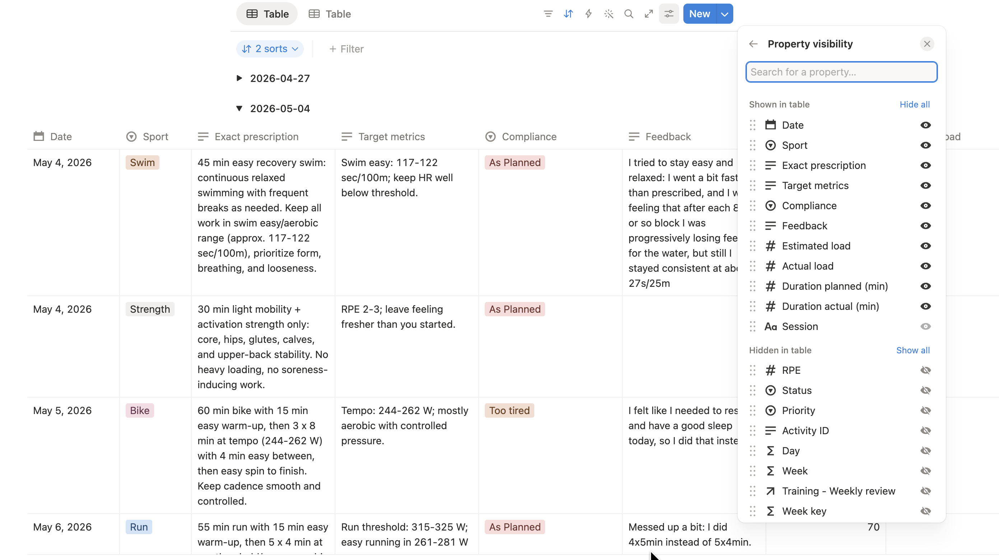
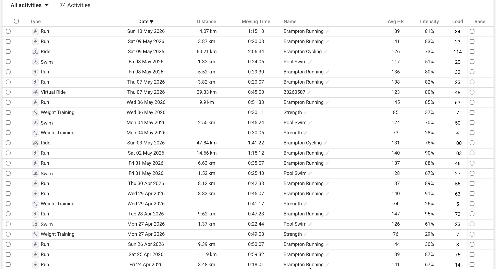

## The challenge

### Concrete problem

The concrete problem was personalized training under a system I could
reliably control.

There are several obvious ways to get training plans, but each one has a
clear limitation.

1. Get a human coach. This is still the best option, but it is not always
financially feasible.

2. Download static plans. They are easy to obtain, but they do not adapt well
to individual specifics, changing goals, current fitness, or shifting weekly
availability.

3. Use a purchased adaptive system. Products such as Humango solve part of the
adaptation problem, but the workflow is owned by the product. If the product
changes behavior, removes a feature, or gradually falls out of sync with the
athlete's workflow, the user has very little control. There is also limited
visibility into how the underlying models behave or degrade over time.

4. Use generic LLM chat directly. This is flexible, but it drifts. As the
conversation grows, responses become slower, context handling becomes less
reliable, updated zones and scheduling constraints are not always applied
consistently, and hallucinations become more likely.

The goal of this article is the next option: a custom system that produces
personalized plans, but does so transparently, reliably, and at a cost that is
still reasonable.

In practice, that means a workflow that can:

- read real availability and scheduling constraints at any time
- use current zones and athlete settings from a canonical source
- incorporate recent training outcomes and season context
- generate a weekly plan as structured output
- validate that output against hard rules
- repair invalid plans

### Abstract problem

The training use case is specific, but the engineering problem is broader. At
a more abstract level, this is a stateful workflow design problem: how to use
an LLM inside a system that must remain inspectable, repeatable, and cheap
enough to run continuously.

The point was not to prove that an LLM can replace a human coach. It cannot.
The point was to build a system where an LLM can contribute useful synthesis
without being trusted for state management, validation, or business rules.

## Abstract Design

### Core Design Principle

The guiding principle is simple:

> Use the LLM model for synthesis. Use code and tables for state,
> constraints, and repeatability.

This principle drove several concrete design decisions:

- store athlete profile, availability, races, season plan, and training
  settings in stable tables
- normalize season-aware coaching state before prompting the model
- keep prompt instructions stable and versioned
- validate generated plans in code against hard rules and repair
  iteratively if needed

This architecture is less magical than a giant chat thread, but much more
reliable.

The pattern generalizes well beyond endurance training. It applies to
scheduling, operations tooling, content production pipelines, intake systems,
and any domain where the LLM should assist decisions without becoming the
system of record.

Once that pattern is clear, the concrete stack becomes almost incidental.

This pattern is also not unique to training. It is closely aligned with the
way several established commercial tools constrain model behavior.

In analytics tools such as Databricks Genie Workspaces, natural-language
questions are not answered by giving the model unconstrained freedom over an
entire data
estate. The system narrows the problem through known tables, curated schemas,
and code-like query boundaries so that common questions resolve to trusted
implementations rather than improvised reasoning.

The same idea appears in specialized agent tooling such as Claude Gems, where
the goal is not a fully general assistant but a narrowly instructed agent that
performs one task well under a stable set of detailed instructions.

This workflow follows the same design instinct. It is home-built, but not ad
hoc. The point is to combine editable state, persistent instructions,
deterministic validation, and narrow model scope in a way that matches the
better practices already visible in mature commercial systems.

### High-Level Architecture

```{mermaid}
flowchart LR
    A["Data tables"] --> B["Normalization layer"]
    C["Fitness data source"] --> B
    B --> D["coach_state and planning context"]
    D --> E["LLM request"]
    E --> F["Structured JSON plan"]
    F --> G["Validation engine"]
    G -->|pass| H["Persist to data tables"]
    G -->|fail| I["Targeted repair request"]
    I --> E
```

The important architectural point is that the LLM never receives raw
authority. It receives a normalized context object and returns structured
output. The surrounding code remains responsible for enforcement.

### Validation and Repair

The planning workflow does not stop at "the model returned JSON."

The generated week is validated against hard rules, for example:

- session dates must stay inside the target week
- day names must match dates
- sports must be allowed on that date
- daily maximum sessions cannot be exceeded
- weekday duration caps are enforced
- brick sessions must be split into ordered single-sport rows with consistent
  naming

This moves correctness from prompt wishfulness to executable logic.

That distinction matters. Prompting can express intent. Validation enforces
the contract.

One of the more useful design choices is targeted repair.

If one or two sessions violate constraints, I do not throw away the whole week
and ask for a brand-new plan. I send back only the rejected sessions or
affected dates, along with the original rules, and ask for replacements.

This provides two concrete advantages:

- lower token usage, therefore lower cost
- less unnecessary churn in valid parts of the plan

That second point is operationally important. Whole-plan regeneration tends to
create drift even when most of the original output was acceptable. Constraining
the repair scope keeps the system stable.

### Failure Modes Observed in Practice

The architecture was shaped by specific failure modes rather than by abstract
design preference.

The most common problems I faced when I used plain ChatGPT were:

- context growth making generic chat slower and less predictable
- stale zones or stale scheduling assumptions being reused by the model
- day and date confusion in longer-running chat threads
- invalid session assignments such as prescribing a sport that was not allowed
  on a given day
- plans that exceeded session-count or duration limits
- unstable full-week regeneration where fixing one bad session created a new
  error elsewhere

Each of those failure modes maps to a design response.

- Structured tables replace remembered chat context.
- Normalized payloads replace prose-heavy state reconstruction.
- Persistent prompt files hold stable rules.
- Python validation catches contract violations.
- Targeted repair replaces full-week re-generation.

That mapping is important because it shows that the workflow was not designed
in one pass. It was tightened in response to actual system behavior.

### Two later extensions

Since writing the first version of this system, two practical extensions have
become important enough that they belong in the architectural picture.

The first is race-aware review. A race week should not be judged mainly
against target training load. It should be reviewed against the athlete's
stated race objectives: pacing, execution, fueling, transitions, and other
pre-race intent. In the current workflow, those objectives live in the season
race table and are carried into weekly review, which now produces both
sport-level observations and an event-level `overall_race_review`.

The second is a local workout library layered on top of retrieval. The system
still uses retrieval-grounded coaching evidence, but weekly planning can now
also surface reusable swim, bike, run, strength, and brick templates from a
structured local library. When a template fits the athlete and the block
objective, the model adapts it. When no template fits, the planner falls back
to ordinary constrained generation. This preserves flexibility while reducing
the amount of session design that has to be improvised from scratch every
week.

## Practical Implementation

At this point, the article stops being purely architectural. The system is not
just designed around these abstractions; it is implemented through concrete
artifacts: prompt files, normalized JSON payloads, validation rules, repair
requests, and terminal-visible usage data.

### System Components

This is my current stack. Nothing cutting edge. Simply the set of tools I was
already using and that fit my workflow without friction.

- `Intervals.icu` for endurance-specific source data such as completed
  activities, planned targets, wellness, and annual-plan phase signals
- `Notion` for structured, editable operational data. It is effectively the
  database, but also one of the main visualization layers
- `Python` for orchestration, normalization, validation, and artifact
  generation
- `OpenAI` for weekly review text generation and structured session planning

The point of this stack is not novelty. The point is that each tool is already
good at one part of the workflow: fitness data, operational state,
deterministic logic, or structured generation.

### System Boundaries

The stack alone does not explain the design. What matters is the ownership
boundary between layers.

- Notion tables hold editable operational state:
  availability, athlete profile, races, season plan, plan rows, review rows,
  and coach-managed settings.
- Python code owns normalization, orchestration, validation, writing artifacts,
  and repair-loop control.
- Persistent prompt files hold stable behavioral instructions that should not
  be rewritten every week.
- Model-generated outputs are limited to narrow artifacts such as structured
  session plans or weekly narrative review text.

In short: Intervals.icu provides training data, Notion holds editable state,
Python owns workflow logic, prompt files hold durable instructions, and the
model is limited to narrow outputs. That separation answers one of the most
important implementation questions: what lives in data, what lives in code,
what lives in prompt files, and what is left to the model.

### Data Model

Most of the reliability in this project comes from the shape of the data, not
the cleverness of the prompts.

I maintain dedicated Notion tables for:

- weekly availability
- weekly plan
- weekly review
- races
- athlete profile
- season plan
- athlete settings and zones

This has three benefits.

1. The model receives current values from a single canonical source instead
   of chat memory.
2. Fields such as availability, load targets, and preferences become easy to
   serialize into a compact payload.
3. The workflow becomes inspectable: if a plan is wrong, I can inspect the
   exact upstream row or artifact that produced it.

When I say maintain, I do not mean constant manual upkeep. I designed the
workflow so manual intervention stays minimal. I edit personal and subjective
information such as session feedback or weekly availability, but the large
majority of fields are filled automatically by the system. My manual edits
mostly provide constraints and overrides.

The database layout can be summarized like this:

```{mermaid}
flowchart TD
    A["Weekly availability"]
    B["Athlete settings<br/>zones and thresholds"]
    C["Athlete profile"]
    D["Season plan"]
    E["Races"]
    F["Weekly plan"]
    G["Weekly review"]

    A --> P["Weekly planning context"]
    B --> P
    C --> H["coach_state builder"]
    D --> H
    E --> H
    G --> H

    H --> P
    P --> F
    F --> G
```

This is not a strict relational schema. It is an operational data model:
several Notion tables feed a normalized planning context, the generated weekly
plan becomes its own table, and completed weeks roll forward into the review
and coaching-state layer.

### Prompt Engineering

The prompt design follows the same separation of concerns as the rest of the
system.

Variable prompt components stay in editable data sources. Weekly availability,
allowed sports, athlete settings, season context, race context, and weekly
review trends all live in Notion tables or normalized JSON artifacts generated
from them. Those are the parts I expect to change every week, so they need to
remain easy to edit without touching code or prompt files.

Constant prompt components live in persistent instruction files. This is where
I define stable behavioral rules such as:

- stay within the maximum allocated time
- only prescribe sessions for sports allowed on that day
- respect weekly session limits
- keep weekday sessions short unless the context strongly justifies otherwise
- format brick workouts in a predictable way

This split matters for two reasons.

First, it keeps the high-variance parts of the prompt editable by changing
data, not by rewriting instructions every week. Second, it keeps the
high-confidence rules stable across runs. The model does not have to rediscover
them from examples or from chat history because they are always present in the
persistent context prompt.

In practice, this means the prompt is not one giant block of prose. It is the
combination of a stable instruction layer and a variable data payload. That is
much easier to reason about, easier to audit, and cheaper to run repeatedly.

A small excerpt from the persistent planning prompt looks like this:

```text
Planning rules:
- return only sessions that fit the availability and constraints
- never exceed max_sessions for a date
- only prescribe sports listed in allowed_sports for that date
- sessions scheduled Monday through Friday should usually be between
  45 and 60 minutes maximum
- every brick segment must be its own row
```

That excerpt matters because these rules do not change every week. They belong
in a stable instruction layer, not in ad hoc edits to the prompt body.

### Operational Characteristics

The current numbers are still based on a small sample, but they are already
good enough to make the discussion more concrete. In the logged runs so far, a
weekly review generation took 2,328 total tokens and about 4.3 seconds. The
planning runs were heavier, as expected. Two logged planning runs consumed
12,761 and 13,925 total tokens respectively, across two requests each: the
initial plan plus one targeted repair pass. End-to-end OpenAI latency for those
runs was 18.6 seconds and 14.4 seconds.

Using the specific model in these runs, `gpt-5.4-mini`, and OpenAI standard API
pricing as of May 10, 2026, that translated to roughly $0.0028 USD for the
weekly review run and about $0.0155 to $0.0174 USD for the planning runs with
one repair pass. Using an exchange rate of about 1 USD = 1.365 CAD on the same
date, that is roughly $0.0039 CAD for the review and about $0.0211 to $0.0238
CAD for the planning runs.

| Run | Requests | Input tokens | Output tokens | Total tokens | Latency | Repair passes | Approx. USD | Approx. CAD |
| --- | ---: | ---: | ---: | ---: | ---: | ---: | ---: | ---: |
| Weekly review | 1 | 2,038 | 290 | 2,328 | 4.3 s | 0 | $0.0028 | $0.0039 |
| Weekly plan A | 2 | 11,191 | 1,570 | 12,761 | 18.6 s | 1 | $0.0155 | $0.0211 |
| Weekly plan B | 2 | 12,062 | 1,863 | 13,925 | 14.4 s | 1 | $0.0174 | $0.0238 |

That is not enough data to claim a stable long-term average yet, but it is
enough to show the operating shape of the system. The expensive step is the
weekly plan generation, not the review. The repair loop does add overhead, but
it does so in a narrow and predictable way rather than by forcing a full
re-generation of the week.

### Concrete Training Example

Now that the architecture, data model, and prompt design are clear, it is
easier to see how the pieces fit together in a concrete workflow.

#### Step 1: Sync Notion and intervals.icu

Suppose I have just finished a week of training. The Notion plan table will
contain the planned sessions together with completion and feedback fields.



At the same time, Intervals.icu will have the detailed execution data imported
from Garmin. I use Intervals.icu rather than Garmin directly because it has a
good API and is inexpensive.



After the feedback columns in Notion have been updated for each session, the
first workflow step is to synchronize Notion with Intervals.icu.

This step is simple by design. It reads execution details from the
Intervals.icu API and writes them into the appropriate Notion columns. For
example, the actual training load from an executed session is stored so it can
later be compared against the planned load.

#### Step 2: Generate a weekly review

In this step, the information stored in Notion tables, mostly the weekly plan,
is compiled into a standardized JSON payload. That payload is combined with a
curated context prompt and sent to OpenAI to generate a weekly review. The
result is written back into a Notion table, and the code lets me inspect both
the payload and the token consumption.

There is still some room for hallucination, but the risk is reduced by giving
the model a clear JSON structure it can use to compare plan versus execution
and infer trends.

```text
(venv) adrianstevejoseph@Adrians-MacBook-Air training_automation % python 02_plan_next_week.py
Planning week starting 2026-05-11
Targets: {'Run': 174.0, 'Bike': 198.0, 'Swim': 44.0}
Active anchors: {'bike_ftp': 253, 'run_cp': 461, 'swim_css': 102, 'bike_z2': (157, 175), 'bike_tempo': (202, 218), 'bike_vo2': (278, 291), 'run_easy': (360, 387), 'run_aero': (373, 396), 'run_mod': (401, 420), 'run_thr': (433, 447), 'swim_easy': (117, 122), 'swim_aero': (110, 114), 'swim_css_range': (105, 107)}
Season context: phase=Build, block=None, weeks_to_next_a_race=5.9
OpenAI model: gpt-5.4-mini
OpenAI planning response request token estimate: input~4821
OpenAI planning response token usage: input=5042, output=1795, total=6837
OpenAI planning response latency: 11.30s

Generated plan failed validation. Attempting one targeted repair pass...
- Generated weekday session too long on 2026-05-15: bike_long_aerobic is 100 min, expected <= 60
- Generated brick row with invalid name on 2026-05-15: 'run_brick'. Expected '02_run_brick'.
- Generated brick row with invalid name on 2026-05-15: 'bike_brick'. Expected '01_bike_brick'.
- Generated weekday brick too long on 2026-05-15: total brick duration is 120.0 min, expected <= 60.
...
OpenAI repair response request token estimate: input~6876
OpenAI repair response token usage: input=7748, output=304, total=8052
OpenAI repair response latency: 3.33s

OpenAI usage summary:
- requests: 2
- repair passes attempted: 1
- tokens: input=12790, output=2099, total=14889
- cumulative latency: 14.63s

Logged OpenAI usage for week 2026-05-11:
- logged runs: 3
- requests: 6
- tokens: input=36043, output=5532, total=41575
- cumulative latency: 47.60s
- repair passes attempted: 3

Plan summary:
- Run: 235 min, estimated load 215.0
- Bike: 135 min, estimated load 101.0
- Swim: 95 min, estimated load 52.0
- Strength: 60 min, estimated load 30.0
Wrote next_week_plan.json
Wrote next_week_plan.csv
```

#### Step 3: Generate a plan for next week

Now that the previous week has been reviewed, the next step is to plan the
next week of training. That planning problem includes season goals, proximity
to key races, current phase, injuries or sickness, general life constraints,
and athlete-specific limiters. If all of this is sent to an LLM as a wall of
text, the result is usually messy.

The LLM therefore needs constrained freedom and automatic validation.

The approach is similar to the weekly review workflow. Data is fetched from
Notion, augmented with Intervals.icu context, consolidated into JSON, and sent
together with the persistent instruction prompt.

### Stable Inputs, Narrow Outputs

With the architecture, data model, and validation boundary in place, the shape
of the model input becomes straightforward.

A simplified planning request looks like this:

```json
{
  "availability": [
    {
      "date": "2026-05-11",
      "allowed_sports": ["Run", "Strength"],
      "max_sessions": 1,
      "notes": "Only evening available"
    }
  ],
  "coach_state": {
    "season_context": {
      "current_phase": "build",
      "weeks_to_next_a_race": 6
    }
  },
  "target_loads": {
    "run": 240,
    "bike": 280
  }
}
```

The point of a payload like this is not that it is elegant. The point is that
it is explicit. The model no longer has to infer scheduling constraints from
prose spread across a month of chat history.

Even with this structure, errors can still appear. The model might schedule a
swim on a day where swimming is not allowed, or prescribe sessions longer than
the available time. This is where the deterministic Python layer keeps the
stochastic model under control. The plan is validated against predetermined
rules, and rejected rows are sent back for correction.

However, the entire plan is not sent back. Doing that would increase token
consumption and create unnecessary churn. If version 1 has a bad Wednesday and
the whole week is regenerated, Wednesday may improve while Friday becomes
wrong. Sending back only the rejected session, together with an accurate
rejection explanation, keeps the repair focused and the rest of the week
stable.

The validation layer produces explicit errors rather than vague human-facing
complaints. A typical rejection looks like this:

```json
{
  "type": "disallowed_sport",
  "message": "Generated disallowed sport on 2026-05-13: Swim not in ['Run']",
  "session_key": ["2026-05-13", "Swim", "Threshold swim"]
}
```

That error can then be turned into a narrow repair request. In practice, the
repair prompt looks more like this than like a fresh full-week generation:

```text
Validation errors:
- Generated disallowed sport on 2026-05-13: Swim not in ['Run']

Rejected sessions or affected dates to replace:
[
  {
    "Date": "2026-05-13",
    "Day": "Tuesday",
    "Session": "Threshold swim",
    "Sport": "Swim"
  }
]
```

This is the kind of implementation detail that makes the workflow credible.
The system is not just asking for a better answer. It is providing a typed
rejection, a narrowed scope, and a structured path to recovery.

### Human Editing and Oversight

The workflow is not fully automatic, and that is intentional. First of all,
I am still refining prompts and implementation details, so I need to be able
to intervene manually.

Furthermore, the manual work is intentionally concentrated in the places where
human judgment is still useful:

- weekly availability updates
- subjective session feedback
- occasional overrides for unusual constraints, races, travel, or fatigue

Everything else is designed to be normalized, generated, validated, and
written automatically.

In practice, the manual burden is already fairly small, although it is not yet
zero.

The recurring user input is mostly lightweight feedback rather than data entry.
For each completed or skipped session, I record a short note that takes roughly
30 seconds. I also add a brief overall weekly comment after reviewing the
generated analysis, which takes about another 30 seconds. Occasionally I also
refresh training zones, which is usually about 10 seconds of work when needed.

| Manual step | Frequency | Approx. time |
| --- | --- | ---: |
| Session-level feedback on completed or skipped sessions | Per session | ~30 s each |
| Overall weekly feedback on the generated review | Weekly | ~30 s |
| Zone synchronization or refresh | Occasional | ~10 s |

Running the full weekly pipeline currently takes about 5 minutes, but that is
not because the system itself is slow. It is mostly because I am still in a
full validation phase and manually double-check the outputs. Once the workflow
is fully operational, I expect the end-to-end process to run in well under
1 minute.

## Tradeoffs and Lessons Learnt

### Benefits

The system has worked well for a few concrete reasons:

- it is modular
- it is more repeatable than long-form chat
- it is cost-aware because the prompts are compact and repair is narrow
- it gives clearer failure modes because data, prompts, and validators are
  inspectable

I deliberately kept the model layer replaceable.

Today the workflow uses OpenAI. Tomorrow it could use Claude or another model
behind the same normalization and validation boundary. That is possible because
the core value of the system does not live in a vendor-specific prompt. It
lives in:

- the data model
- the orchestration code
- the validation rules
- the narrow contract between context and output

That is where most production-minded LLM systems should concentrate their
complexity budget.

### Possible Drawbacks

- this is more engineering work than using an off-the-shelf product
- the system still requires maintenance when schemas or APIs change
- an experienced user is still needed to spot bad prescriptions, even if
  the likelihood of it happening is significantly reduced
- software can support coaching judgment, but it does not replace it


### Lessons Learnt

- reliability comes more from data modeling and validation than from prompt
  cleverness
- prompt engineering works better when variable inputs stay in editable data
  sources and stable rules stay in persistent instruction files
- the more state you ask the model to remember implicitly, the worse the
  system gets over time
- narrow repair passes are better than full regeneration for both stability and
  cost
- if the workflow matters, controllability matters as much as model quality
- if a system must remain reliable over time, explicit boundaries matter more
  than prompt cleverness alone

### Portability

The pattern is more portable than the training domain suggests.

What is domain-specific here is the payload content: races, zones, planned
load, wellness, and weekly availability. What is reusable is the structure:
editable operational state, normalized context, persistent instructions,
validation rules, and targeted repair.

The main limitation today is that the workflow is built around the systems I
personally use, especially Notion and Intervals.icu. That is acceptable for a
single-user or small-scale setup, but it is not the right foundation for a
broader multi-user system.

To adapt this pattern to other athletes or coaches, several things would need
to change:

- the Notion-backed operational layer would need to be replaced by a more
  conventional application database
- a dedicated frontend would be needed to unify the user experience and
  replace Notion as the interactive layer
- connectors would need to be added for other popular fitness platforms such
  as Garmin and Strava
- the normalization layer would need to become more configurable so that
  athlete-specific rules, coach preferences, and source-specific schemas could
  vary without rewriting core logic

All of that is technically feasible. The main issue is not conceptual, but
operational: once the system moves beyond a personal workflow, it starts to
inherit the usual scaling concerns around architecture, maintenance, support,
and cost. The current implementation is not designed for that scope, and it
does not need to be.

## Future Work

The next additions are relatively clear.

- Add a more explicit way to review and refresh zones so that threshold and
  anchor changes are surfaced intentionally rather than only flowing through
  the existing data pipeline.
- Add on-demand single-workout review so that the system can be queried
  interactively about one session without waiting for the full weekly review
  cycle.
- Add a dedicated frontend once performance, workflow stability, and token
  usage have settled enough to justify simplifying the user experience.

At the moment, those additions are less about new ideas than about deciding
when the current workflow is stable enough to justify a cleaner interface.

## Conclusion

The main value of this system is not that it uses an LLM. The main value is
that it puts the LLM inside a workflow that is inspectable, constrained, and
replaceable.

That makes the system easier to control than direct chat and more resilient
than outsourced product behavior that can change underneath the user. It also
produces clearer failure modes: when something goes wrong, the issue can be
traced to data, normalization, prompts, or validation rules instead of being
treated as an opaque model quirk.

For this kind of problem, that is the real engineering win. The useful
abstraction is not "AI coach." It is a controlled planning system with an LLM
as one component.
